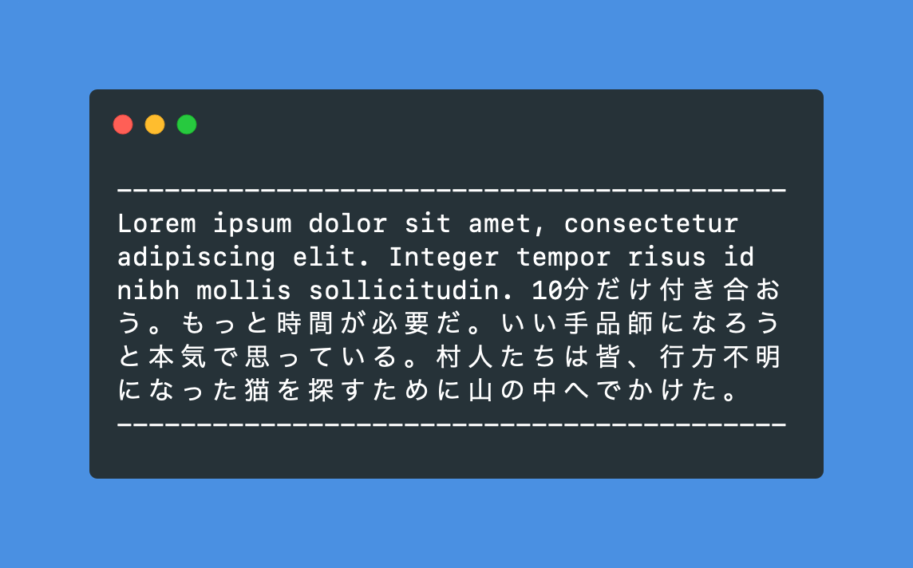

[](https://opensource.org/licenses/MIT)

# wordwrap-cjk

This is a string wrapping library with basic support for CJK language wrapping rules. It's intended to be used for command line utilities.

CJK languages (Chinese, Japanese and Korean, plus historic Vietnamese) present two special considerations for word wrapping in the terminal: visual character width, and the wrapping rules that differ from that of Latin text. While Latin words are split by spaces, in CJK languages words are typically wrapped per-character. Since CJK characters are visually larger, they are displayed as two columns wide in the terminal, which also needs to be taken into account.

This word wrapping library automatically detects what characters are in a string and treats them accordingly. It does not support [advanced wrapping rules](https://en.wikipedia.org/wiki/Line_breaking_rules_in_East_Asian_languages) such as Kinsoku Shori.

## Example

Here's an example of it in action using a mixture of Latin and Japanese text:

```js
const { wordWrap } = require('wordwrap-cjk')

const input = `Lorem ipsum dolor sit amet, consectetur adipiscing elit. Integer tempor risus id nibh mollis sollicitudin. 10分だけ付き合おう。もっと時間が必要だ。いい手品師になろうと本気で思っている。村人たちは皆、行方不明になった猫を探すために山の中へでかけた。`
const wrapped = wordWrap(input, { maxWidth: 42 })
const separator = '-'.repeat(42)

console.log(separator)
console.log(wrapped)
console.log(separator)
```

This prints the following to the console (with separator lines used to indicate what the maximum width should be):

<p></p>

Latin text is wrapped by splitting the words by whitespace, and all wide characters are split per-character.

## Usage

To install:

```
yarn add wordwrap-cjk
```

Find [this package on npm](https://www.npmjs.com/package/wordwrap-cjk).

## Options

The following options can be passed:

| Option | Type | Description |
|:-------|:-----|:------------|
| maxWidth | int,&nbsp;str | Maximum width of the output. This can be either a number value or a percentage such as `"100%"`. If a percentage is given, the value is calculated based on the terminal size. |
| indentAmount | int,&nbsp;arr | Amount of indentation. This is either an integer or an array of two integers; with the array, a left and right indent can be added. |
| indentChar | str | The character used to indent the string. |
| indentType | str | There are two types of indent: either the indent string is repeated, or the indent string is cropped to the desired width. Must be `"repeat"` or `"crop"`. |
| lineCallback | func | Callback function that runs on each line as it's split. Performed before any line trimming is done. If the callback function returns null or undefined, the line is skipped entirely. |
| newlineBeforeLongWords | bool | Whether to insert a newline before a long word that exceed the maximum width. |
| newlineChar | str | The character used to create newlines. |
| whitespaceChar | str | Character to convert all whitespace to, if `whitespaceNormalize` is true. |
| whitespaceMaintainLinebreaks | bool | Whether to keep linebreaks intact when normalizing whitespace. |
| whitespaceMaintainWideSpace | bool | Whether to maintain CJK wide space characters even when `whitespaceNormalize` is true. |
| whitespaceNormalize | bool | Whether to normalize all whitespace characters to the same one. |
| whitespaceTrim | bool | Whether to trim the end of the result string. |
| textDirection | str | Either `"ltr"` (left to right) or `"rtl"` (right to left). |
| breakLongWords | bool | Whether to break really long words (longer than the available space) up into chunks. |
| padToMaxWidth | bool | Whether to pad all lines to the full (visual) line width. Padding is done using the whitespace character, and is on if there is a right indent. |
| throwOnError | bool | If any of the passed options are invalid, revert to using the defaults rather than throwing. On by default. |
| useVisualWidth | bool | Whether to determine string length based on the visual width of the characters. This means wide characters (such as CJK wide characters or emoji) count double. |

## Known issues

* The `textDirection` option doesn't work very well yet and isn't included in the tests. All it does right now is change the way the padding works.

## License

© MIT license.
